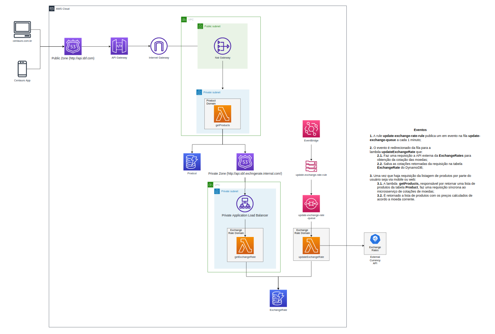

<h1 align="center">
Teste Grupo SBF - Backend
</h1>

<p align="center">Solução para obtenção de produtos com preços corrigidos pela taxa de câmbio de diferentes moedas em tempo real</p>

<hr>

## Utilização da API de produtos

### URL Base

```
https://i7k75lnyzb.execute-api.us-east-1.amazonaws.com/dev/api/v1
```

### Listagem de produtos

**Definição**

`GET /products`

**Params**
- `"category": string` categoria do produto
- `"baseCurrency": string` moeda de referência do preço produto (Ex.: BRL)
- `"targetCurrency": string` moeda para qual deve ser realizado o câmbio do preço do produto (Ex.: USD, EUR, IRN)

**Resposta**

- `200 success.` em caso de sucesso

```json
{
    "products": [
        {
            "promotionalPrice": 529.99,
            "currency": "BRL",
            "imageUrl": "https://imgcentauro-a.akamaihd.net/500x500/5351432Y/tenis-nike-shox-r4-masculino-img.jpg",
            "colors": [
                "red",
                "pink",
                "gray"
            ],
            "rating": 540,
            "updatedAt": "1970-01-20T06:45:43.378Z",
            "category": "shoes",
            "createdAt": "1970-01-20T06:45:43.378Z",
            "price": 749.99,
            "id": "e3f43c83-3310-40c5-9b56-1b366e605ea4",
            "name": "Tenis Nike Shox"
        },
        {
            "promotionalPrice": 649.99,
            "currency": "BRL",
            "imageUrl": "https://imgcentauro-a.akamaihd.net/1300x1300/96946451A1/tenis-adidas-streetcheck-feminino-img.jpg",
            "colors": [
                "red",
                "blue"
            ],
            "rating": 4.8,
            "updatedAt": "1970-01-20T06:45:43.378Z",
            "category": "shoes",
            "createdAt": "1970-01-20T06:45:43.378Z",
            "price": 849.99,
            "id": "e3f43c83-3310-40c5-9b56-2b366e605ea4",
            "name": "Tenis Adidas"
        }
    ],
    "message": "success."
}
```

## Observações

### Arquitetura da solução

<p align="center">
    
</p>

* [Url do Diagrama](https://viewer.diagrams.net/?tags=%7B%7D&highlight=0000ff&edit=_blank&layers=1&nav=1#R7V3rl5q6Fv9rXOucD7oID5GP6ow9XaunZ1bn9vb2fJkVISotEsvDmelff5MQEJKIWFFnptiHEkgC%2B%2FHbOzs7oWdM10%2FvIrhZ%2FY09FPR0zXvqGTc9XQdDZ0i%2BaMlzVqIDALKSZeR7%2FKpdwb3%2FE%2FFCjZemvofiyoUJxkHib6qFLg5D5CaVMhhF%2BLF62QIH1V43cImkgnsXBnLpF99LVlnpyNJ25X8hf7nKewYaP7OG%2BcW8IF5BDz%2BWiozbnjGNME6yX%2BunKQoo9XK6ZPVme84WNxahMGlS4duXT3f%2F%2BQzs2T16f7%2BIZutwrfftrJUtDFL%2BwHeRv4UJojeczkOU8JtPnnOKbLAfJoyq1oT8JZ1OtZ5Fzkzp0UC3hALx2K4WAPmItlEtEI%2FtagEQmwdC%2F0C8wVKBdFRpXhP610o3SP4aE5wmgR%2BiaSF%2FGilcRtDzCV%2BmOMARKQtxSKg3WSXrgBwB8vNx5SfofgNdStVHojykbIHDhGsA0PNjTnjaKpHxBJK%2BIt4G4wSKbrcoY0h2TRDATezPi1oRctMo9rfoE4qzxmkpkcYN%2Fb1%2BWlLNHcDH2BwsI5xu2O2%2FJ30pzz7EtDk%2FeX7YXXyfRPh70TA7yB%2B8pxvAtG8nY%2Fo4fhCUym%2BHM302IuVbFCU%2B0bhx4C9ppwmmzUJ%2BFKBFQpslpPLD5Qd2dGNonDyqfjwYr5DHb4fLN%2BkCPe1VHFCoIwEyhNcoiZ7JJXkFzeQqzEHMMPjx4w4R9BEvW5XQwBiaHIk4Ci2LxneKSn5wXT1Cb4eS3kp6StgTegUdVPJWEkeBNwuL%2FpFpnH1UXB6yT0sEN5wRVdsSyS0gkxwMDZnkwBydieTWmya5dgLJLeNMJNc769RZp8461WquYzkVte0DXWGdTIV10nNX9RS9TR91%2FG5150ywuw7fbb%2FeJ6Df11%2B6eZLIq2DCforng5qc4vaoIVAaLdgmNcE1ib7II%2BMYfoijZIWXOITB7a50UuXA7poPmIo4o%2Fs3lCTPXOlhmuAqV9CTn%2FyPVh8Ay%2BLHX%2Bm5gWbww5sn3jw7eM4PQvLQWU0rP%2FxaPrerxo4q9e5Q5BOqMZzJWxbL9nI5gdES8aLpHHz%2F8vGzHSbvPoYPs1UQf1r1dc4iSr5aYYhQABOCW5XmVYxlVcdRBJ9LF3AztWv5jhaU7DEYVa2xbQijO7FC4ZSqK5Af2T3s74%2FYjWqfw6ExcLTdR3jIGKeRi3hDggAXhGpm%2FIdh%2BG8y8%2BP4%2B4P%2BzrP%2FiZ6%2F9YEpgQhh3e2Tu4LhEn1iXoAg8%2FF3lLgrLgNKT0DpDag8AqVXIHsGlcuYrVb0IBaqymy5EMiX5eZdLlSVqXwZsTZQ1AZC7f2ehIC%2F5M%2BMcljyMMi5mT261czSuRuf2P7EZ5Y8pOgj4%2FyNZk2BrcLzBfuI5jS31R%2FgHAV3OPZ583OcJHh90Ji7KGQQUrE8B7weGG8yciz8J3ofatclQpmyZI4LcXpilQsTwPXcg%2B0YKQBMUHXnLdktyA1X2UjZLdgoJbIC1QBqGFD3yfO3FUUe%2FkhpVGxCnjXpc%2B6MyRXc22JxvDDpZw4jPQGszRM7kdckv5b8m%2FVAr1d2cWxDc2Ur8vVgkNcgxJqXWoFrKnLhPKZftMsoDeh4ptRBdm268QjG9REHvH5Ej7KLDze8SecBEXTSbrqm1oz9Rz1xTH6EtJyoGmzS7Y8UpUhsXnULtDUXevQL0PinH2YOQ%2BnajAtVgpJixv5q6WuSiEjxSM2ftLX7IGOQUNnQHLrfl8zZ67sZgjKxW87%2F0GmwhGizppsO%2F2Fpf9b2cjRjahQpK9Abaco%2FZQHuTY3e2GFOmEetCEF56NETXkmyCXzSL%2FqPA%2BseIRZEv%2BphHL6zH2nGoVbF%2BWgmK6sQQ%2BlUBTCr37BNNijrx9mojN7eJkKndVViejOAnMGfDMMgY%2FaP1I99xnyb%2FW9gzuDx3XsqH0%2FEfDNw85TQVuZsrO49l5oL0gbPExSKD8UewMUJlE%2FEFFwxoj%2FqQOjtSEozgLiHwRZmfotIuYlF2U3kJ8FEPDIKejUSxUQooT7khUWhVmKb2GAGgjfPIVzjm8lB03Msl1%2BmITnBgGpuMaLYFdJRzMJAZzP4b4PqhcgZjbTzM0PwLaJoTg0mGXPAbzUqyNQz8OMELpnv6iGmV9gjPiVV3w2hAwNrNhfAxD6NU1YfRD49jBFrf%2BtDhpdzn3nZOKUjIDQvWWyZnfPGvGlP9Y2GBnFc487IFm%2BJkjtKNJfGmqZN2idD0w0O44ySW5bNkdGao2dUmGPGnZw1F6RUSQo8JVAXz8YfXf3YVF0Wh72LjBI3oRthZhYgvuzTrn3ScxyjaMtvDeckV9o4dqaBd3AdEW9myenjjJySwc69vIrElcTAxRQiMlwgN5eRiZ2AgZsGpIH4CnIKXRwVt85Ywm41okEdNNjPmqOsxh7L064xOXps3Z6V%2BVXqCIFh2nGvEterRhT5DGg5%2FMiLpNigGEJc%2B57HplNUU1jVKZaAItWk4EA5OMo%2BxZ2fFvmzTWHqwJECf8XcfiVbxWhhPlAd%2BlPNBx4XT2vB2%2BMuNQsixAcUqIpPr1WaysFrsyXpcgTpMmXpGqqE61yylU%2FYlWSrmyN6pXNE5o1NTvaOmiMiH3PiSDr4VueIPDa49%2BYtabPugIFoLS43T6TMZcgzJy6cy9B2SkKprTwtoleXE9EoZUFJMNNQpiwQCjJ5qqmZ5emcmtsgJxNodjVDBgAB%2FfekDhydJaHlUph3dChLAuRpuuoK1SyJX8hkUJMZXEOiGwnUJXNgZG6YAjeGwzPJidhRu9k0bclJ7qhfJ4sLlKBqB1x7ErgUOVclBNVYoscOQweWM%2FwVHN0rwgeRzW6InXmSUXuifpLtk5fjqOYkO4%2F21Xi0XdbTZbOezCtmPdUCTF0q9IHkZ4nYLyobGth61VRaitVRxarISjr02fLPlalmdahZonZFtRhnYmEdRJX6%2Bsi2bvVabRUxmdhHhjIDOtSp4CEHK6HUUZaqENtx9jRss9rkfANQpu5f5VqGhKKGf0%2FnKAqJsY4Hfqbfm3xdBtz4rQiWEGmyDEsSLEshV22sAFOLlRzGzA0zKeVZJS8yVtgOOwQ9H8nLHs4V%2BVOzQ%2FaWbrMMIFp1mtKZFpc%2BAcsO%2Bm34MjRl%2FL0oX2zzKsOYNgM4e%2FlSHlDUrlo4%2B9hZjGSYdrOxc1uD1Vx8Tkjnjgk162d7jpzH9EPi%2BxLtV05ams0SghfQrXY1XsOfmN7F7ZpYvGxq9C8UbFGSJVh%2FZPnRtPQTJi43zn6PI3oj7GcMw7gfEwlbHM49AkPggIV8k7t1r%2BPNhmZ2Mx9f1z5g6JEvAkowdOndHZrV2jOJXJlTrfOUThoQKUCVRf11ezzeh8AvbqgjrmsF%2B4Y%2FcMeph4Dw6WGec6kd4AfitgTDK4918qjvC4lzHgwSGYYM6uoIOzgLqB8bxiy83XzhqeHoZaY1qMBHRmcNY%2BZkLVkGqngwjfDAxesBTeq4MMSwy2%2FeHsS4gc%2BkvhU8EULefVMxkFfiyfBceGJf15EUYtiXjWAb5isHJyJQLxGc5HjclINT5lx12NQSNmU51w%2BtQpQpblLT1y1dAqlcIy7i9JhXmbT7dVw5E1xI6m3Ze9S7aCNDtrMNUPMHVQxQ9w4rxZxYPc%2BEzb4NUE6IXcC1HzxnVxc5zHsGjdWzWWtiqTyoVNU6PMisHf1qzQfhd2wNMbnkXwpFuvbHKkk2rNKM%2FIUbfxDPF9Sj%2B7NpGm43U1kpe1EzlY5p3cz03lEzldbY0CaWZLre6kwlQe0EPVhGO8asGK4XAGmZzfzts5ky60WZsoOebz4%2BOX%2BsNc%2FMySMt4sxlW3lKYkf5rpKN89mOrmAczJgTn%2F0SmVCmHELogssXCC7XWnq6JUi4RHQfkgEbAxAtH7C1V7M%2Fzx947tyFzl34nd0FaUMnkA%2BwruUuWFdxFy4%2Fz6t%2BeOdCvoeYuqw7zXyPtkyxJSe91OxMdeHY2UTTRuYbjJ1RYj7obQXNLHOQhz1zIdLkoYYFBoYuw4el7RfZ0%2BDjKtH9EzR%2BeCWNB2Kmzrk1XrGikkrsJPLpo3de2uvx0mYzczaaHOelTabAsIa%2FjZfGNpWbZ6J9nhx0xX7cl03LeGVhHftKOFscXwpnnUaelbwXRr4nZwfEHRC%2FHSCOf8TFs%2Bav2qoFkhMg%2BZKpcso3m4DR9TBZWid%2BYBpZ%2BQAjGczVD2qcCN6nkVm%2FBplfyF4Cx%2FK59lUehxl9layjo3cAcEz14Krx9Xa70x9KWsqOwX%2FvppIkd686%2Bq1fdbTduCrfgLixI7bZk2LpUkvvMhqPJ%2FZkJLofe4zyMe8yGjlVZeubiuW7hmoxk2UKvnt7JkRe59IpY6eMb18ZgQaq2lhkPZSV0VAooylu99OeMso5fXSTVzeVXwTYjYZf7mi42%2Bft%2BH3eTntJoKb2Yq83%2FpXT8It00%2B7Nnp2FbeHNnkrbS9%2Fs6RBcGrZngIt%2BWn%2Bz57A6ads3VW%2F21G1ZbXWthSVZNeGcit5%2BhHS4%2FA4m6BE%2B15vhbvFw4wyAECYPS07ThtJUA7R7Zcw2hQU1w8vlIKvv94pZAYcDZu1PQonxq76UcLFnFqpBU8WbgNtfcVMXEy5hw3uWJoo6gGgfIHxO2mNRot7m2NKizDzt5VqAcJ1XGzcFhAYzJYBHcw9G0EcnIsxpuCvHnLOXqjXS2258%2FaLG111y9sHxNdz47SKnvN716sgpB8vGX%2B5JwTTAqdeNr7vxdXl8TX4%2BuFQwHmC2OkoaT%2BeAc75YdtFF20NpXZxYshSxbGCodpMEprgpeWsKaqij2eyVZdoNXhOZkLT0Je1b%2BCvj0UP%2Bp1Z9c4Cp6xKfLrqZoS6xqPJOvc4pejVOUbcV9ylbcdd7GI0z8WxpBxdTsYHLRd0kQ1ZxYVffN4HGhyZ7HZExxTviSowZgfNAr5oxcqz5N2SMcUnGkMMI07Xhu7AgRYe%2FsYfoFf8H)


### Clean Architecture

<p align="center">
    
</p>

A arquitetura da aplicação seguiu o Clean Architecture. De acordo a figura acima, os módulos possuem a seguinte correspondência:

* [domain](./src/1-domain): Enterprise Business Rules
* [application](./src/2-business): Application Business Rules
* [adapters](./src/3-adapters): Interface adapters
* [framework](./src/4-framework): Framework & Drivers

### Infra

* Para o provionamento e Configuração das Lambdas foi utilizado o Serverless Framework.
* Os demais recursos foram provisados com o Terraform

## Referências

* [Clean Architecture - jbuget](https://github.com/jbuget/nodejs-clean-architecture-app)
